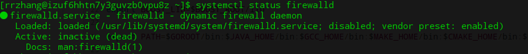

> 参考 [Centos7.3防火墙配置](https://www.cnblogs.com/xxoome/p/7115614.html)

#### 1、查看firewall服务状态
```
sudo systemctl status firewalld
```



#### 2、查看firewall的状态
```
sudo firewall-cmd --state
```

#### 3、开启、重启、关闭、firewalld.service服务
```
# 开机自启
sudo systemctl enable firewalld.service
sudo systemctl disable firewalld.service

# 开启
sudo systemctl start firewalld
# 重启
sudo systemctl restart firewalld
# 关闭
sudo systemctl stop firewalld
```


#### 4、查看防火墙规则
```
sudo firewall-cmd --list-all 
sudo firewall-cmd --list-ports
```


#### 5、查询、开放、关闭端口
```
# 查询端口是否开放
sudo firewall-cmd --query-port=8080/tcp
# 开放80端口
sudo firewall-cmd --zone=public --permanent --add-port=80/tcp
# 移除端口
sudo firewall-cmd --zone=public --permanent --remove-port=8080/tcp
#重启防火墙(修改配置后要重启防火墙)
sudo firewall-cmd --reload

# 参数解释
1、firwall-cmd：是Linux提供的操作firewall的一个工具；
2、--permanent：表示设置为持久；
3、--add-port：标识添加的端口；
4、 –-zone #作用域
```